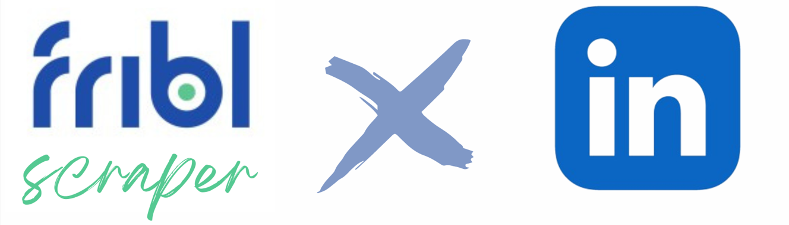

# Fribl Linkedin Scraper
<h3 align="center">
 
</h3>
Packages

## Description

This repository contains a script designed to scrape public information from LinkedIn profiles. The motivation behind this project is to enhance Fribl's database and improve their AI capabilities.

- **Motivation:** Traditional CVs are limited in detail due to space constraints, making it difficult for recruiters to fully assess a candidate's skills and experience. LinkedIn profiles offer a more comprehensive view, making them valuable for improving recruitment processes.

- **Problem Solving:** Fribl is transforming recruitment by using AI to match CVs with job requirements, aiming for faster and more accurate matches. However, effective AI training requires ample data, which LinkedIn profiles can provide abundantly.

- **Learning Experience:** This project has been a valuable learning experience, involving web scraping techniques, threading for efficient data retrieval, and creating a user-friendly script. While it's a good starting point, there is room for ongoing improvement.

